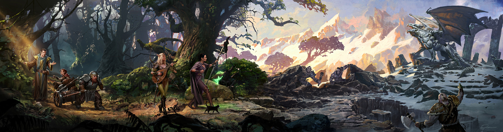

<h1 align="center">Barbearia Alura</h1>

  
  

 

### Sumário 

🔹 [Descrição do Projeto](#descrição-do-projeto)

🔹 [Deploy](#deploy)

🔹 [Tecnologias Utilizadas](#tecnologias-utilizadas)

🔹 [Instituição de Ensino](#instituição-de-ensino)

🔹 [Desenvolvedor](#desenvolvedor)

 

## Descrição do Projeto 

Para treinar os conceitos aprendidos durantes os cursos de <strong>HTML5</strong> e <strong>CSS3</strong> da Alura, resolvi desenvolver esse site sobre um <strong>RPG</strong> (<em>role-playing game</em>) chamado <strong><em>Dungeons and Dragons</em></strong> (abreviado como <strong>D&D</strong>). Essa temática foi escolhida por ser um tema que vem crescendo nos últimos anos e se tornando um hobbie cada vez mais popular e presente na culturar pop. Exemplo desse crescimento e importância é sua aplicação na área escolar como um método de ensino, onde os professorers podem inserir conteúdos e testar habilidades na sala de aula de forma mais lúdica. Outro motivo para escolha desse tema é a facilidade de encontrar conteúdo e imagens sobre <strong>D&D</strong> para compor a identidade visual do site.

Cada página tem o seguinte foco:

- Home: A;
- Jogo: A;
- Personagem: A;
- Enquete: A.

Para criar essas páginas várias funcionalidades foram aplicadas, por exemplo:

- Criação de cabeçalho e rodapé para manter uma identidade visual nas páginas;
- Texto e formatação;
- Adição de imagens e configurações de suas dimensões;
- Uso e formatação de listas;
- Adição de elementos externos como vídeos e mapas;
- Adição de links para permitir a navegação entre as páginas;
- Introdução de formulário para ......??????;
- Interações dos elementos da página com o cursor do mouse;
- Elementos de edição, como o uso de degradê, opacidade e sombra.

 

## Deploy

> ...
  
 
  
## Tecnologias Utilizadas
  
- `HTML5`
- `CSS3`
  
 

## Instituição de Ensino
  

 

## Desenvolvedor

| [ Diego Borelli Dias](https://github.com/DiegosXe) |
| :-----------: |
  
 
